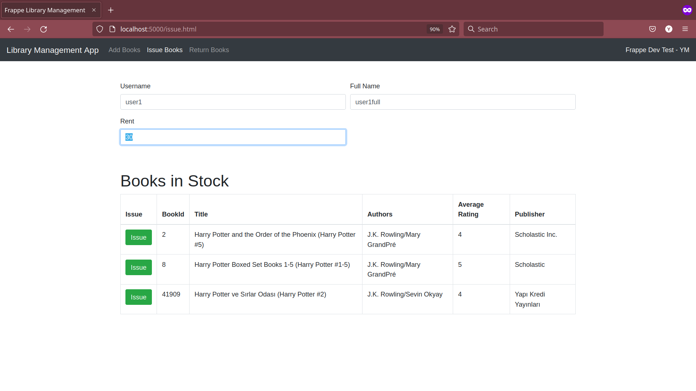
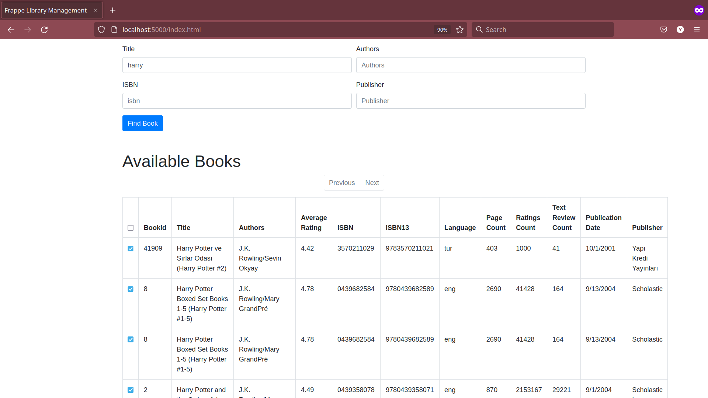
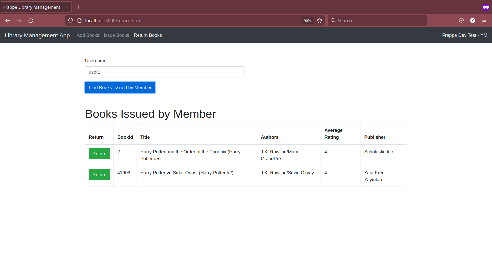

# Frappe Dev Test - Library Management Application

## Installation Instructions

- Prerequisites include `python3.10`, `mariadb`
- Install dependencies using `pip install -r requirements.txt`
- Create `.env` file in root directory. Example:

```
FLASK_APP=app
FLASK_DEBUG=true
APP_DB=frappe
APP_DB_USERNAME=frappeuser
APP_DB_PASSWORD=password
APP_DB_HOST=localhost
```

- Create database/users and initialize tables using `source ./create_db.sql` in MariaDB prompt
- Start Flask server using `flask run`

## Screenshots




